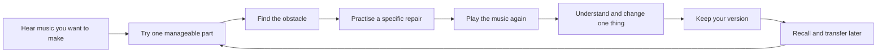

# Guitar Academy: design and learning audit

10 September 2026 · Second audit · Recommendations, not an implementation plan approved for development

**The strongest next version would help George turn a sound he wants to make into something he can play, understand, remember and change.** The current app has an unusually clear philosophy and useful foundations, but it often gives the learner instructions and a place to report success where a teacher would demonstrate, diagnose, simplify and listen again.

The opportunity is to make the teaching loop work beautifully for a small amount of music, then extend it. More content, a new visual identity or a conversational AI alone would not resolve this.

This review combines the supplied engineering audit, current project documents, source inspection of the active V8 learning and creative flows, and a local browser walkthrough. It distinguishes observed behaviour from proposed designs. It does not establish learning effectiveness through a real learner study.

**The central design decision**

Make a musical phrase, riff, groove or short piece the shared object of the experience. The learner hears something inviting, works on a manageable part, understands one relationship, plays the music again, changes something deliberately and keeps a version.

Learn, Play, Explore and Create can remain. They should become different ways of working with that same music. Their navigation already has a sensible size; the missing connection is the material and purpose carried between them.

**What a successful teacher needs to do here**

| Teaching responsibility | Observable product behaviour |
| --- | --- |
| Establish a reason to care | Let me hear what I am working towards and choose a sound that interests me. |
| Find my actual starting point | Distinguish what I can hear, explain and physically play. |
| Demonstrate | Show and play the exact task, including the hand action where necessary. |
| Set a manageable challenge | Give me a clear attempt with one main variable to control. |
| Respond to difficulty | Change the task in response to the obstacle, then return me to the music. |
| Build independence | Gradually remove cues and revisit the skill after a delay. |
| Help me use it | Carry the relationship into a different phrase, key, position or expressive choice. |
| Help me recognise progress | Show a concrete new ability or a comparison I can hear. |

These are design criteria, not eight more dashboard panels. Much of this should happen inside one practice screen.

## What to preserve

The relationship-first model is the project's most valuable asset. Root, degree, chord tone, function and physical position are distinguished deliberately. Creation belongs in the learning process, and unfamiliar notes are allowed to have contextual meaning. The restrained green and paper palette and consistent navigation give the app a recognisable identity.

Free Play already offers a useful alternative to formal study: one prompt at a time, optional assistance, permission to skip, and no score. Keep that low-pressure role. The local Sketchbook, exact voicings, recording retention and revisions are useful foundations for hearing personal development.

Recent improvements are also real. The current onboarding defaults to the beginning and includes a sound check; the activity includes a notation legend, action guidance and a success criterion. Older walkthrough complaints about those things should not be carried forward as though nothing changed.

The [Learning Effectiveness Backlog](/Users/georgethomasbarber/Developer/guitar-dashboard/docs/LEARNING_EFFECTIVENESS_BACKLOG.md) already identifies much of the required work. This audit changes the organising idea and proposed order: prove a complete musical learning experience before deeply expanding even the first twelve units.

## 1. The app asks for commitment before offering much musical attraction

**Observed.** Onboarding leads with philosophy, 48 units, session length, instrument choice and a self-selected starting point. Continue leads with an abstract promise, course location and a completion ring. The first unit's outcome is to discover what is secure and choose repairs. These are reasonable programme descriptions, but they offer little musical payoff to anticipate. [App](/Users/georgethomasbarber/Developer/guitar-dashboard/apps/current/src/app/App.tsx:106), [Today](/Users/georgethomasbarber/Developer/guitar-dashboard/apps/current/src/v8/features/Today.tsx:18).

**Design judgement.** A person opening a guitar app needs an inviting reason to pick up the guitar. Starting with self-evaluation can make the experience feel like an assessment of deficiencies, even when the wording says it is non-judgemental.

**Proposed change.** Offer a few short, reviewed previews at suitable difficulty: a sparse groove, a melodic answer, a two-chord accompaniment. The choice should be audible. Ask which one the learner wants to make, then start with an achievable part of it. Allow someone who already has a goal to choose it directly.

For George, retain one editable musical aim near the current work: for example, “Make a two-chord backing I enjoy playing” or “Find a melody by ear.” These are example goals, not assumptions about his present ability or taste. The app's choice of next task should explain its connection to that aim.

**Success test.** A learner can say what they are working towards, and make the first relevant sound, without reading a course overview.

## 2. The visual hierarchy favours explanation over action

**Observed.** At 1280 × 720, the first activity devotes its initial view to a large title, purpose, instruction, duplicated study text and reporting panel. The actual study and reference playback are further down. At 390 × 844, the initial view is almost entirely text; the formatted tab and audio control are below it. This is more than a phone layout defect: it determines where the learner's attention goes.

**Proposed change.** Give practice a different layout from reference reading. Keep the visual identity, but place the musical task first:

1. One short action: “Play four even notes on the thinnest string.”
2. The exact playable material: enlarged tab, a local fretboard, or a hand demonstration.
3. A stable transport: Hear example, Count me in, Loop, Stop, and tempo.
4. One listening cue: “Leave the same gap between each note.”
5. After a short block of attempts: a useful comparison or repair choice.

Put “Why this matters,” terminology, theory detail and evidence history behind contextual disclosure. Explain a term where it appears; the glossary at the bottom of Explore is a useful reference, but a long trip for someone holding a guitar.

The design target should be use at music-stand distance, not just readability while holding the phone. Avoid typing and scrolling during a playing block. Keep the target stable while the learner looks down at their hands. Spacebar or a simple optional pedal mapping could eventually control replay; neither is needed to prove the first version.

**Success test.** The current action, playable material and essential controls remain visible together on a phone. The learner can repeat several attempts without navigating or filling anything in.

## 3. A prompt is not yet a lesson

**Observed.** The 48 units are generated from nine activity templates. Each unit shares one micro-study across those activities. Most instructions, success criteria and repair advice remain generic. The existing integrity repairs clarify the request, but do not author the missing teaching decisions. [Curriculum](/Users/georgethomasbarber/Developer/guitar-dashboard/apps/current/src/v8/curriculum.ts:147).

**Design judgement.** “Hear, predict, play, vary, create, transfer, reflect” is a good repertoire of teaching moves. Requiring the same separate moves for every topic can turn that philosophy into paperwork. A learner controlling a note's release may need a demonstration and repeated short attempts; someone learning thirds may need a controlled sound comparison and a fret movement. They need different interactions.

**Proposed change.** Author lesson episodes around an outcome and likely obstacles. Let the author choose which teaching moves serve it. A comparison can include listening, prediction and explanation in one coherent interaction. A variation can become the saved creative object without opening a second assignment.

Each episode needs exact musical material, a demonstration, a starting difficulty, common errors, two or three repairs, a cue-removal step and a transfer challenge. Content review should test whether an uncoached learner can actually begin and recover from difficulty.

**Success test.** The learner never has to invent the missing exercise, demonstration or success standard in order to complete the lesson.

## 4. Difficulty produces more reporting than useful teaching

**Observed.** In the browser, choosing “Needs another pass” produced “This stays in your path,” general advice to simplify, and a retry button. The retry resets the same activity. The generated hint says to reduce tempo or material. Strengthen prioritises weaker activities, but selecting the weak activity is not the same as selecting an appropriate repair. [ActivityPlayer](/Users/georgethomasbarber/Developer/guitar-dashboard/apps/current/src/v8/components/ActivityPlayer.tsx:139), [learning](/Users/georgethomasbarber/Developer/guitar-dashboard/apps/current/src/v8/learning.ts:77).

**Proposed change.** Give “Help me with this” a small set of concrete branches appropriate to the lesson:

| Learner's obstacle | Immediate teaching response |
| --- | --- |
| “I don't understand what to do.” | Demonstrate one attempt with the exact string, fret and count. |
| “I can't hear the difference.” | Repeat a controlled A/B contrast, then isolate the changing sound. |
| “My fingers can't make the change.” | Practise only that transition, or use a reviewed easier voicing. |
| “I lose the beat when I move.” | Keep the rhythm on one note, then restore the change. |
| “It works while the guide plays.” | Alternate guided and unguided bars, then remove more support. |

Return to the original music after the repair. Otherwise the learner can become good at isolated corrections without being able to perform the phrase.

Do not turn honest reporting into an indefinite lock. After repeated difficulty, allow an easier successful version, a related activity, or a planned return. Keep the unresolved capability visible without making “I succeeded” the easiest way to escape.

This can begin as authored branching. It does not require AI to infer technique from a microphone.

## 5. Teaching and checking are mixed together

**Observed.** The activity displays “Independent attempt” before the learner has worked. Hint and reveal use are tracked against mastery, with a prominent explanation of what will not count. On listening tasks, playback immediately displays the interval caption. This is useful guided exposure, but does not itself establish unaided identification. [ActivityPlayer](/Users/georgethomasbarber/Developer/guitar-dashboard/apps/current/src/v8/components/ActivityPlayer.tsx:53).

**Design judgement.** Keeping evidence honest is correct. Presenting that accounting throughout initial instruction risks making useful assistance feel costly. Conversely, calling an attempt independent because the Hint button was not used ignores labels or answers already visible in the normal interface.

**Proposed change.** Distinguish three states of an episode:

- **Learn it:** demonstration, labels and assistance are normal.
- **Practise it:** repeat, compare and gradually remove cues.
- **Try it unaided:** a short, clearly signposted check with the relevant cues withheld.

Cue removal must match the skill. Hide note labels for a location check; withhold the answer caption for listening; remove the model guitar while retaining a backing pulse for playing. A blank screen is not universally a harder or better task.

Give feedback after a short playing block when possible, rather than requiring a verdict after every tiny action. A learner should spend time making music and learning to notice it, with occasional checks that support the next decision.

## 6. Progress has too little memory of specific abilities

**Observed.** Every activity in a unit receives that unit's strand IDs. For example, the first listening activity can record sound, rhythm and reflection evidence together. “Secure” is derived from successful unassisted days; once accumulated, later failure does not remove those historical successes. The V8 session builder selects unfinished activities from the next unit and does not schedule delayed retrieval from earlier units. Strengthen exists separately. [Curriculum](/Users/georgethomasbarber/Developer/guitar-dashboard/apps/current/src/v8/curriculum.ts:191), [learning](/Users/georgethomasbarber/Developer/guitar-dashboard/apps/current/src/v8/learning.ts:36).

**Proposed change.** Keep a small capability record underneath the interface: what action, on what material, under which conditions, with what support, and how it was assessed. “I identified the third in a diagram” and “I played the third over a changing chord” must remain different claims.

The learner-facing view can be simple: “You played this at 60 BPM with the guide”; “Try it once without the guide”; “Last checked two weeks ago.” Preserve past achievements while recommending a refresh. Absence is not proof of lost ability.

Include brief delayed recall in Continue itself. Use changed examples to check transfer: an unfamiliar phrase, another root, a different string set, or a related rhythmic setting. Record the context actually attempted; a global settings change alone is not evidence that the learner transferred the skill.

Free Play also needs capability-specific matching. Its current ability level can advance from any completed activity in a higher unit. That is too broad to establish readiness for every lower-numbered physical task. [freePlay](/Users/georgethomasbarber/Developer/guitar-dashboard/apps/current/src/v8/freePlay.ts:47).

**Success test.** The app can recommend a precise next action because of a relevant attempt, and a learner's improvement survives a delayed, less-assisted check.

## 7. The session needs a musical arc and a satisfying ending

**Observed.** Continue proposes five timed selections. The activity's “Continue to next” follows the unit's unfinished activity order, then later units, rather than that five-item session. This means the visible plan and actual continuation are different structures. [learning](/Users/georgethomasbarber/Developer/guitar-dashboard/apps/current/src/v8/learning.ts:124), [ActivityPlayer](/Users/georgethomasbarber/Developer/guitar-dashboard/apps/current/src/v8/components/ActivityPlayer.tsx:105).

**Proposed change.** A session should maintain its own plan while allowing repairs and detours. An example: recall yesterday's riff, fix today's transition, use it in a complete groove, keep a version, then stop. Adjust the amount of work to available time, rather than simply shrinking every activity's minutes.

Offer a short return session after a gap. Use a supportive invitation such as “Play something familiar, then choose one small next step.” Avoid presenting a backlog of missed obligations.

End with an honest statement of what happened: “You reported keeping the pulse through the change. Next time we'll try it without the guide.” If there is a recording, let the learner hear what changed. “You kept music moving” should not be inferred from advancing through prompts alone.

The progress ring can remain secondary. The main reward should be something the learner can now do or hear.

## 8. Musical application should arrive earlier and recur

**Observed.** The course outline progresses from sound and time through fretboard geography and tonal hearing, with formal triad work beginning at Unit 19. There is earlier two-shape playing and creative work, so chords and music are not wholly absent. However, Create's beginner guidance asks for two chords even when the guided learner is working on one open note. The core guided material is mostly tiny studies rather than an accumulating repertoire. [Curriculum](/Users/georgethomasbarber/Developer/guitar-dashboard/apps/current/src/v8/curriculum.ts:45), [Create](/Users/georgethomasbarber/Developer/guitar-dashboard/apps/current/src/v8/features/Create.tsx:117).

**Proposed change.** Build a small library of pieces worth returning to. Each can have a one-note part, a simple accompaniment, a melody or riff, and a later expressive variation. The learner can participate before understanding every theoretical layer.

Use a spiral: perform an accessible fragment; learn something that improves it; return to the fragment; later discover a deeper relationship in the same music. Understanding remains central, while formal vocabulary need not precede every satisfying musical act.

Do not make every piece a disposable demonstration. Keep favourites and familiar material available. Later, let the learner bring a chosen song, external reference or their own recording into a manually specified practice goal. Full automatic transcription and a licensed catalogue are unnecessary dependencies for this.

Style should be heard through real differences in rhythm, articulation and texture. Avoid teaching emotional responses as fixed answers such as major equals happy and minor equals sad. Compare examples, name the structural change accurately, and let the learner describe their response.

## 9. The four areas need to carry the same music

**Observed.** The creative activity opens a new sketch and provides a return route, which is a useful bridge. The sketch itself starts empty in C major at 72 BPM; it receives neither the activity's study nor a concrete variation task. Free Play's handoff similarly creates a blank sketch. Explore links pitch, chord and fretboard selections, but is not a focused investigation of the phrase being learned. [ActivityPlayer](/Users/georgethomasbarber/Developer/guitar-dashboard/apps/current/src/v8/components/ActivityPlayer.tsx:210), [newSketch](/Users/georgethomasbarber/Developer/guitar-dashboard/apps/current/src/v8/repository.ts:400), [Play](/Users/georgethomasbarber/Developer/guitar-dashboard/apps/current/src/v8/features/Play.tsx:124).

**Proposed change.** Carry the phrase, tempo, key, rhythm, voicing and current question between areas. “Make it mine” should open a copy of what was just played. “Why does this work?” should open the relevant relationship, in the same fretboard region, and return to the same practice point.

Create should begin with the learner's material and one available next move: change the ending, move one accent, or record a response. Reveal fuller harmony and arrangement controls as needed. Audio capture should remain a valid starting point for music the learner cannot yet label.

For any transformation, show the before and after and preserve the original. An audible, reversible one-note change would be more educational than six broad experiment buttons. The data model will need an explicit musical event representation: current micro-studies store tab and rhythm as text, which is insufficient to guarantee exact playback, visual highlighting and transformations agree. [types](/Users/georgethomasbarber/Developer/guitar-dashboard/apps/current/src/v8/types.ts:63).

## 10. The highest-value new feature is a shared practice player

**Observed.** The active activity offers isolated interval playback for some task types; technique and rhythm tasks rely on written material and a reported attempt. Free Play has short previews. Create has chord playback and recording. Useful count-in and audio primitives already exist, but are not combined into a complete player for the guided micro-study. [ActivityPlayer](/Users/georgethomasbarber/Developer/guitar-dashboard/apps/current/src/v8/components/ActivityPlayer.tsx:190), [audio engine](/Users/georgethomasbarber/Developer/guitar-dashboard/apps/current/src/audio/engine.ts:67).

**Proposed first player.** One reviewed phrase, exact reference playback, count-in, adjustable tempo, repeat, a clear stop, and synchronised highlighting. Add alternating demonstration/learner bars and optional local record-and-compare. For a physical technique, a short reviewed demonstration should show the relevant hand action in normal and slow versions.

Keep feedback matched to evidence. Browser pitch analysis can support selected clean, sustained single-note tasks after input checks. It should not pretend to judge complete chord cleanliness, expressive phrasing or hand tension. Teacher-authored error examples and focused self-comparison can help substantially without automatic grading.

Free Play can reuse this player while keeping its ungraded character. A continuous backing pulse, a loop that stays until the learner moves on, and a way to preserve a promising fragment would make it more like playing with support. Automatic advance should be optional and tied to clear musical boundaries.

**Success test.** What the learner sees, hears and is asked to play is the same phrase at the same tempo and in the same position. Repetition requires no navigation.

## A concrete proposed lesson: change one note and hear the colour

This is a design example for a learner who can fret and pluck single notes. It is not a claim that George has that prerequisite, or that these proposed assets have been performed and reviewed.

**Outcome:** hear and play the difference between a major and minor third above a fixed root, then use that difference in an original two-bar answer.

Use standard tuning. On the B string, fret 1 is C, fret 4 is E♭ and fret 5 is E. Play the notes sequentially; do not ask a beginner to hold a four-fret stretch. The first comparison uses C–E versus C–E♭ with identical timing and articulation. Initially provide a quiet C reference before each example.

| Moment | What the learner does | What the app provides |
| --- | --- | --- |
| Hear the destination | Hear two short phrases with one altered note. Choose which version to explore first. | Reviewed A/B performances with matching rhythm. No emotional answer key. |
| Get oriented | Find and pluck B-string fret 1. | A close local diagram and optional hand demonstration. |
| Copy | Play C–E, then C–E♭ at a comfortable pace. | Count-in, exact tab and repeat. No mastery judgement during demonstration. |
| Understand | Follow E moving one fret down to E♭ while C stays fixed. | Labels: C is the root; E is 3; E♭ is ♭3. Show and hear the same change. |
| Practise | Alternate the two pairs, then answer the reference without it doubling the guitar. | Cue fading and a stable pulse. |
| Repair if needed | Choose help with hearing, locating or timing. | A different specific repair for each obstacle. |
| Use it | Play C–E–G–E, then C–E♭–G–E♭, using B1, high e0, high e3, high e0 for the major version; replace each E with B4 for minor. | Exact reviewed event timing and fingering guidance. A two-note version remains available if string crossing adds too much difficulty. |
| Make it personal | Choose one version; alter only its last rhythm or ending note. | A prefilled two-bar sketch with optional recording. |
| Return later | Identify the third without labels, then move C–E/E♭ to D–F♯/F on the B string: frets 3–7/6. | A delayed retrieval check, followed by transfer with assistance available separately. |

The material should get a guitar-playability and audio review before release. The important change is the continuity: the comparison becomes a physical action, the action becomes a phrase, and the phrase becomes the learner's own version.

## Which additions deserve investment?

These are relative judgements about scope and dependencies, not delivery estimates.

| Addition | Why it matters | Scope and first move |
| --- | --- | --- |
| Shared practice player | Makes repeated guitar practice possible inside the lesson. | Medium to large. Prove one phrase, not a general editor. |
| Authored repair branches | Gives the app a useful response to struggle. | Medium, with substantial musical authoring. Cover three recurring obstacles first. |
| Same music across Learn/Play/Explore/Create | Removes the learner's burden of reconnecting concepts and reconstructing material. | Medium. Carry one phrase into a prefilled variation. |
| Small repertoire with layered parts | Gives practice emotional purpose and music to revisit. | Ongoing content effort. Start with a few compelling original pieces. |
| Capability-specific recall and progress | Makes recommendations and progress more truthful and useful. | Medium to large. Model only the capabilities exercised by the pilot. |
| Before/after listening | Lets the learner recognise improvement and choose revisions. | Medium. Local paired takes plus one specific comparison question. |
| Personal musical goal and brief placement | Makes the path relevant without pretending all abilities share one level. | Small to medium. One editable goal and a few optional checks. |
| No-guitar companion practice | Connects commute listening to later physical practice. | Later. Reuse the same phrase and keep its evidence distinct from playing. |
| Contextual AI explanation | Could answer “why?” or offer a different explanation of the current material. | Later and bounded. Ground it in reviewed content and exact context; do not let it invent performance assessment. |

A full DAW, more top-level destinations, hundreds of generated lessons, comprehensive chord recognition, leaderboards and a general chat tutor would be poor next investments. They introduce more surface area before the central learning experience has been demonstrated.

## Recommended sequence

**First, protect the practice session.** Resolve the engineering audit's data-loss and misleading-behaviour issues as a small enabling workstream. They matter because an interrupted or untrustworthy practice session undermines the teaching experience.

**Then, build one complete learning episode.** Choose one early sound/rhythm outcome or the thirds example above at an appropriate starting level. Deliver the player, exact material, one useful failure path, a small creative result and a later recall check. Keep the current application and reuse its domains. This does not require another versioned application or a shell rewrite.

**Observe it with a guitar.** Have George use it without live coaching. Watch for uncertainty, unnecessary touches, unhelpful feedback and moments that invite another try. Check again on a later day. Revise the episode before expanding content.

**Prove three different kinds of teaching.** Add a rhythm/coordination episode, a pitch/relationship episode and a musical variation episode. This checks whether the design serves different learning problems rather than fitting one attractive demonstration.

**Then scale into the first twelve units.** Deep authoring now has a tested delivery form. Review later material for prerequisites, complete performances and physical-skill coverage. Keep provisional content labelled by review status rather than treating course locks as proof of content quality.

## How to tell whether it actually helps

Run a small personal trial over roughly two weeks, not an engagement dashboard. Choose two or three capabilities that George wants and does not already perform reliably. Record the starting condition, practise the new episodes, and revisit matched and changed examples later. Retain recordings only with his choice; a local observation sheet is enough.

| Question | Evidence to collect |
| --- | --- |
| Does the task make sense? | Can he begin without someone explaining the instructions? |
| Does the interface support playing? | Count interruptions needed to repeat, slow down or find the current material. |
| Does difficulty lead somewhere? | After an unsuccessful attempt, does the repair produce a more manageable attempt and a return to the phrase? |
| Is learning retained? | Can he do it later with less support, under recorded comparable conditions? |
| Does it transfer? | Can he preserve the relationship in a changed example or context? |
| Does it support musical agency? | Can he choose and explain a variation, or hear why he prefers one version? |
| Does he want to return? | Does he voluntarily replay the music or use the relationship outside the assigned activity? |

These are proposed product tests, not validated thresholds. A personal trial can reveal whether the design is useful to George; it cannot establish general effectiveness for all learners. Time spent, completed units and confident self-report alone cannot answer the learning question.

## Research informing the judgement

The project already expresses many sound principles. A focused source check supports the direction, with limits:

- The US Institute of Education Sciences practice guide recommends spaced learning, combining examples with independent problems, connecting concrete and abstract representations, retrieval and explanatory questions. These support returning to a phrase, linking sound to notation and movement, and checking recall after a delay. The guide rates its recommendations at different evidence levels; it is not a trial of this guitar app. [Organizing Instruction and Study to Improve Student Learning](https://ies.ed.gov/ncee/wwc/practiceguide/1).
- Wulf, Shea and Lewthwaite review observation, attention, feedback and learner-controlled practice in motor learning. They distinguish immediate practice performance from retention and transfer. This supports pairing demonstration with playing, allowing control over repetition, and testing later. Applying those findings to the particular guitar interactions proposed here is a design inference, not direct validation. [Motor skill learning and performance](https://gwulf.faculty.unlv.edu/wp-content/uploads/2014/05/Wulf-Shea-Lewthwaite-2010.pdf).
- Ryan and Deci's review links motivation with support for autonomy, competence and relatedness. This informs meaningful musical choice, achievable progress and a supportive response to difficulty. It does not prescribe a particular reward system or prove that any proposed interface will motivate George. [Intrinsic and extrinsic motivation from a self-determination theory perspective](https://selfdeterminationtheory.org/wp-content/uploads/2020/04/2020_RyanDeci_CEP_PrePrint.pdf).

## Scope and verification

Reviewed the active app's onboarding, Continue, activity presentation and retry flow, Free Play, Create and Explore in a fresh local guest browser context. Inspected Course map and Strengthen behaviour in source. Examined the curriculum definitions across all eight stages, session/mastery logic, creative handoffs, shared audio primitives and the relevant learning documents. Checked the initial activity visually at desktop and phone dimensions.

The local walkthrough created one synthetic retry and one empty sketch in the fresh guest context. These are test interactions, not George's learning evidence. No account was signed in and no microphone permission was requested. Playback controls and implementation were inspected; recorded guitar sound quality, physical execution, learning gains and live-device behaviour were not validated. The prior audit's test counts are not claimed as rerun here.

This report adds no application changes. Existing uncommitted work was preserved. No commit, push or deployment was performed.
